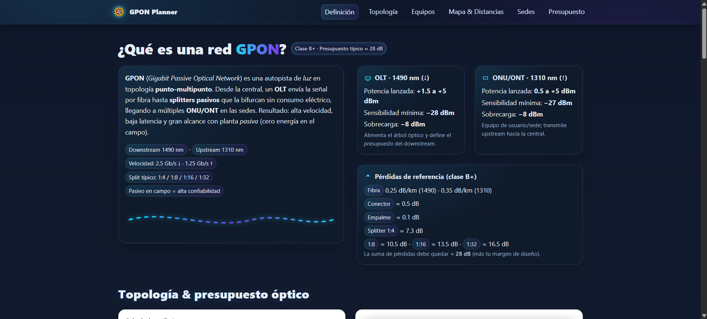

# 🚀 GPON Planner

Un planificador visual y calculadora para redes **GPON (Gigabit Passive Optical Network)**.  
Incluye topología en estrella, mapa interactivo, galería de sedes y presupuesto óptico.

---

## ✨ Características

- 📍 **Mapa interactivo** con ubicación de sedes y cálculo de distancias.  
- 📊 **Calculadora óptica (B+)** con pérdidas, conectores, empalmes y splitters.  
- 🌐 **Topología visual** en estrella con nodos OLT, Splitters y ONTs.  
- 🖼️ **Galería de sedes** con imágenes locales y selección interactiva.  
- 🧮 **Presupuesto óptico** con tabla editable y totales en USD.

---

## 📸 Vista previa



---

## ⚙️ Tecnologías usadas

- **HTML5 / CSS3 / JavaScript (Vanilla)**  
- **Leaflet.js** → mapas interactivos con OpenStreetMap  
- **LocalStorage** → persistencia en el navegador  
- Diseño estilo **neon/futurista** ✨

---

## 🚀 Instalación y uso

```bash
# 1. Clona este repositorio
git clone https://github.com/tu-usuario/gpon-planner.git

# 2. Entra a la carpeta
cd gpon-planner

# 3. Abre el proyecto en tu navegador
# (doble clic en index.html o con Live Server en VSCode)
